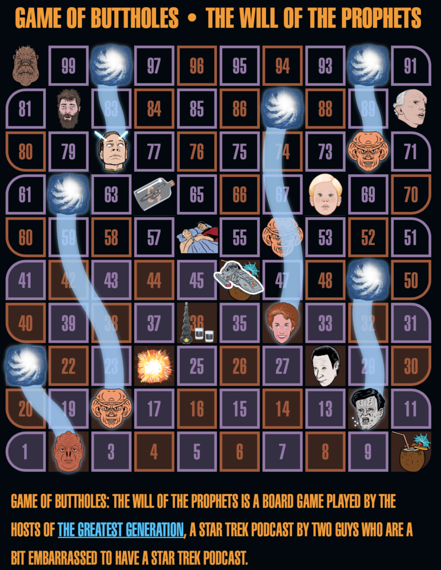
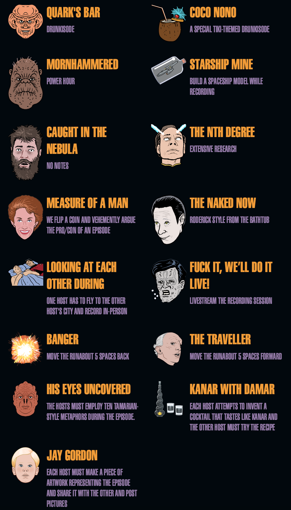
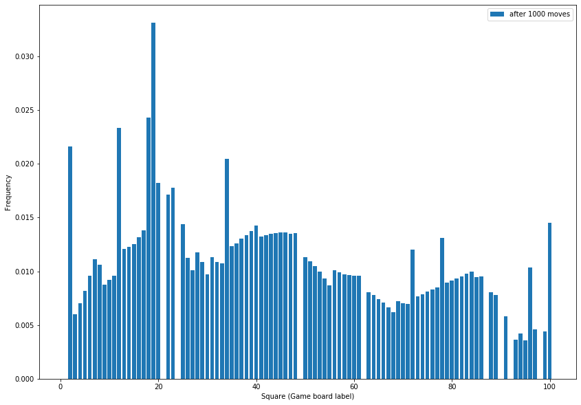

I listen to a podcast on the [Maximum Fun](https://maximumfun.org) network called [The Greatest Generation](https://art19.com/shows/the-greatest-generation), a Star Trek podcast by two guys who are a little bit embarassed to have a Star Trek podcast. Every week they watch and review an episode of Star Trek: Deep Space Nine. They're professional filmmakers and hearing about this show through their eyes[^gaze] is an education in the craft of creating a TV show.



Every episode they play a game that they call [*The Game of Buttholes: Will of the Prophets*](https://gagh.biz/game/). It's your basic Snakes and Ladders clone, but with consequences. Each square with a wormhole on it sends you back to the indicated square; each square with a picture triggers a special episode. Some are fairly benign ("Quark's Bar" just means they drink during the recording (err...more than they would otherwise?). Others are more intensive--square 56 means that one of the hosts must purchase a plane ticket and fly to the other's city for a live recording[^looking].



Occasionally the hosts react to complaints that these special episodes aren't triggered more often; I read their position as the (emminently reasonable) "we're not your monkeys!" So I wanted to see if the game is tilted to produce more or fewer special/event squares than you would expect.

Of the squares on the game board, 18 are "special"[^bathtub]. Of those 18, two ("Banger" and "The Traveller") are essentially wormhole squares. As Ben and Adam play the game, how often do they land on the stunt squares? Is it more than the ~16% of the time that you might naively intuit? A quick look at the board indicates that it has to be: there are 7 ways to land on "The Nth Degree" (6 from rolling directly onto the square, one from a wormhole at square 98).

I thought I would make up a transition matrix to see which, if any, squares got visited more often. I made some approximations (I assumed that they can't skip past square 100, for example). Let's see what I found out!

We're going to need some libraries...


```python
import numpy as np
import matplotlib.pyplot as plt
np.set_printoptions(precision=2)
```

These are the slide squares: 6 wormhole squares, one banger (move back 5), and one Traveller (move forward 5). Note that the squares are indexed from 0 even though they are labelled from 1 on the game board.


```python
SLIDE_SQUARES = {
    20: 1,
    23: 18,
    48: 11,
    61: 17,
    86: 33,
    89: 95,
    91: 71,
    97: 77,
}
```

This sets up the transition. Each value is the probability of moving from square `i` to square `j`.


```python
def tm(nsquares=100):
    tm = np.zeros((nsquares, nsquares))
    for i in range(nsquares):
        for j in range(i+1, i+7):
            if j in SLIDE_SQUARES.keys():
                tm[i, j] = 0
                tm[i, SLIDE_SQUARES[j]] += 1 / 6
                continue
            if j < nsquares:
                tm[i, j] += 1 / 6
            else:
                tm[i, -1] += 1 / 6
    tm[-1] = np.zeros_like(tm[-1])
    for j in range(1, 7):
        tm[-1, j] = 1 / 6
    
    assert np.allclose(np.sum(tm, axis=1), np.ones_like(tm[:,0]))
    
    return tm
```


```python
def after_n_moves(n, board_size=100):
    transition = tm(board_size)
    pos = np.zeros((1, board_size))
    pos[0, 0] = 1
    pos = pos @ np.linalg.matrix_power(transition, n)
    return pos
```

Are there any squares that are more likely overall? To find this I chose an arbitrarily large number of moves in the future and looked at the probability of being on each square.


```python
f = plt.figure(figsize=(14, 10))

plt.bar(x=range(1, 101), height=after_n_moves(1000).ravel(), label=f"after {1000} moves")
plt.ylabel("Frequency")
plt.xlabel("Square (Game board label)")

plt.legend()
plt.show()
```





Some suspicious looking peaks there! Do these peaks correspond to special events?


```python
np.argsort(after_n_moves(1000))[0][::-1]
```


    array([18, 17, 11,  1, 33, 19, 22, 21, 99, 24, 39, 16, 38, 44, 45, 43, 47,
           42, 46, 41, 37, 40, 15, 77, 36, 35, 14, 34, 13, 12, 71, 27, 30, 49,
           25,  6, 50, 28, 31, 32,  7, 51, 95, 55, 26, 83, 52, 56, 82, 57, 29,
           58, 60, 10, 59,  5, 81, 85, 84, 53, 80,  9, 79, 78,  8, 54, 76, 75,
            4, 74, 62, 87, 73, 88, 63, 72, 64, 68, 65, 69,  3, 70, 66, 67,  2,
           90, 96, 98, 93, 92, 94, 97, 61, 20, 48, 86, 23, 91, 89,  0])


```python
EVENT_SQUARES = {
    "Quark's bar": [17, 53, 71],
    "Coco nono": [45, 9],
    "Mornhammered": [99],
    "Starship mine": [63],
    "Caught in the nebula": [81],
    "The Nth degree": [77],
    "Measure of a man": [33],
    "The Naked Now": [27],
    "Looking at each other during": [55],
    "Fuck it, we'll do it live!": [11],
    "His Eyes Uncovered": [1],
    "Kanar with Damar": [35],
    "Jay Gordon": [67]
}
```


```python
SQUARE_EVENTS = {}
for k, v in EVENT_SQUARES.items():
    for vi in v:
        SQUARE_EVENTS[vi] = k
```


```python
after_1000_moves = after_n_moves(1000)
```


```python
tot = 0
for e, ss in EVENT_SQUARES.items():
    frac = np.sum(after_1000_moves[0][ss])
    tot += frac
    print(f'Spend {frac*100:0.0f}% of the time on "{e}"')
print(f"A total of {100*tot:0.0f}% spend on special squares")
```

    Spend 5% of the time on "Quark's bar"
    Spend 2% of the time on "Coco nono"
    Spend 1% of the time on "Mornhammered"
    Spend 1% of the time on "Starship mine"
    Spend 1% of the time on "Caught in the nebula"
    Spend 1% of the time on "The Nth degree"
    Spend 2% of the time on "Measure of a man"
    Spend 1% of the time on "The Naked Now"
    Spend 1% of the time on "Looking at each other during"
    Spend 2% of the time on "Fuck it, we'll do it live!"
    Spend 2% of the time on "His Eyes Uncovered"
    Spend 1% of the time on "Kanar with Damar"
    Spend 1% of the time on "Jay Gordon"
    A total of 22% spend on special squares


They do! Poor Ben and Adam are spending one episode out of every twenty in Quark's Bar, even though only one out of 33 squares are represented. All in all they're being forced to drink 9% of the time! The rest of the time they're drinking for fun, can't blame that on probability.

Let's see how often each special square shows up when ranked in order of frequency of occurrence.


```python
ordinal = lambda n: "%d%s" % (n,"tsnrhtdd"[(n/10%10!=1)*(n%10<4)*n%10::4])
```


```python
for i, s in enumerate(np.argsort(after_n_moves(1000))[0][::-1]):
    e = SQUARE_EVENTS.get(s)
    if e is not None:
        print(f'{ordinal(i+1)}:\t{e}')
    else:
        continue
```

    2nd:	Quark's bar
    3rd:	Fuck it, we'll do it live!
    4th:	His Eyes Uncovered
    5th:	Measure of a man
    9th:	Mornhammered
    15th:	Coco nono
    24th:	The Nth degree
    26th:	Kanar with Damar
    31st:	Quark's bar
    32nd:	The Naked Now
    44th:	Looking at each other during
    57th:	Caught in the nebula
    60th:	Quark's bar
    62nd:	Coco nono
    75th:	Starship mine
    84th:	Jay Gordon


1. Second most occupied square is a "Quark's bar"
2. Third and fifteenth most occupied squares are "coco-nono"
3. Fourth most occupied square is "His eyes uncovered"
4. Fifth most occupied square is "Measure of a man"
5. Ninth most occupied square is "Mournhammered"

## Conclusions

Yup, poor Ben and Adam. Forced to consume alcoholic beverages of their own choosing! Forced to go through weird internet stunts! I don't know anything about game design, so I can't say how likely this outcome is to be the result of a nefarious actor. I just know now that Ben and Adam are doing more special episodes than I thought they would be, and that the fans who complain about not enough special episodes? Well...at least the math isn't on their side.

[^gaze]: Sounds like a mixed metaphor, but they insist that the consumers of their audio media be referred to as "viewers". I like the conceit.

[^looking]: Adam is in the process of moving from Seattle to Los Angeles, where Ben already lives. Maybe this square becomes less problematic at that point?

[^bathtub]: There *used* to be a square that meant they did the episode "Roderic style"--while taking a bath. AFAIK, they did this once, and agreed "never again". I can't blame them, as the recording equipment they use doesn't seem cheap, but it was still a good episode.


```python

```
